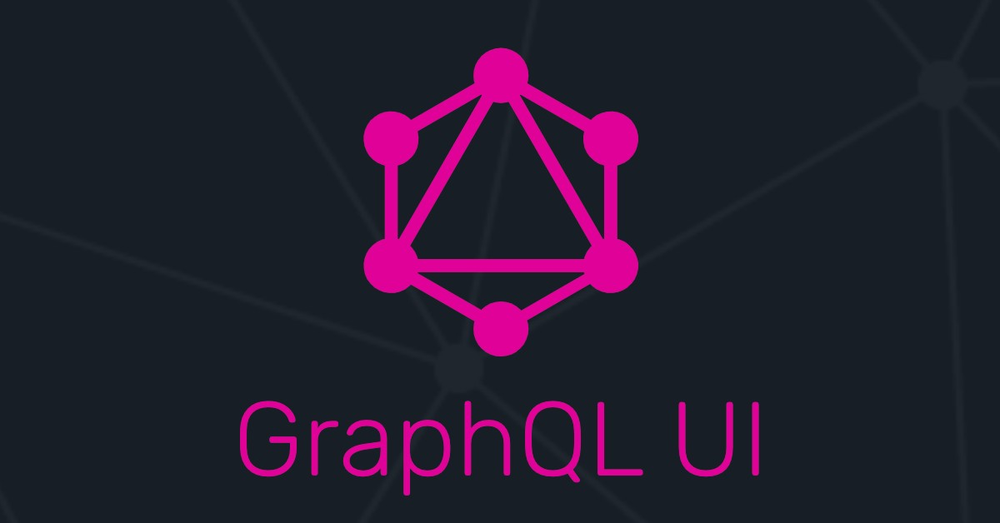

<p align="center">
  
</p>

<h2 align="center">
  Convert your GraphQL queries into forms on the fly!
</h2>

Evade all the hassle of writing complex queries while debugging your API. GraphQL UI simplifies the process by generating forms for your queries and mutations on the fly by interpreting your schema. Just type in your url and select a query. Your will see a form generated automatically based on the InputType. Once you fill in the data and click submit, GraphQL UI will parse this data to a GraphQL request and provide you with a response.


## Invoke the server locally

```bash
serverless offline
```

## Deploy

In order to deploy the endpoint, simply run:

```bash
serverless deploy
```

